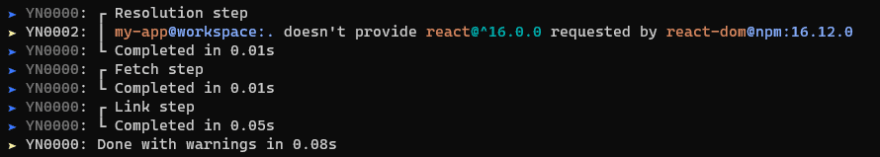

이번에 토스 컨퍼런스를 보면서 yarn2의 존재를 알게되었다.

(🥲 이제서야...)

이번 포스팅에서는 yarn2/berry에 대하여 알아보는 시간을 가지겠다.

---

**목차**

[Yarn 2의 이점](#Yarn-2의-이점)

---

# Yarn 2의 이점

## 출력의 가동성 향상



- 출력 메세지의 생상 추가
- 출력 포맷의 재설계 (step 별로 묶어줌)

##

## Plug'n'Play 전략

-

# 설치 방법

→ Global 설치

```
npm install -g yarn@berry
```

→ 프로젝트 별 설치

```bash
# yarn 설치
npm install -g yarn
# yarn 버전 확인
yarn --version
# 특정 프로젝트 이동
cd "이동을 원하는 프로젝트 경로"
# 프로젝트에 yarn2 적용
yarn set version berry
# 프로젝트에 yarn1 복귀
yarn set version 1.22.5
```

---

# 마이그레이션

1.

---

# 참고

- https://yarnpkg.com/cli/set/version
