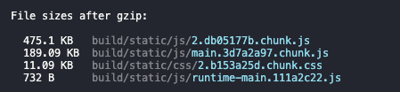
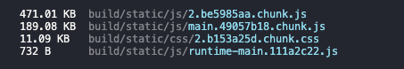

이번에 토스 컨퍼런스에서 발표한 이한님의 'Bundle Diet' 영상을 보고 일부를 적용해 보기로 하였다.

그 중 제일 빠르게 적용 가능한 `yarn-deduplicate`를 사용하여 bundle 사이즈의 크기를 줄여보려고 한다.

## ⚽️ yarn-deduplicate 설치

```bash
npm install -g yarn-deduplicate
# 또는
yarn global add yarn-deduplicate
```

## 🏀 yarn-deduplicate 적용 명령어

```
cd 프로젝트_경로
yarn-deduplicate yarn.lock
```

## ⚾️ 적용 전 후 번들 사이즈 비교

[ 적용 전 ]



[ 적용 후 ]



# 🥎 결론 및 간략한 분석 내용

- 청크 파일에서 미비하지만 4kb의 이득을 얻었다 😅
- `yarn-deduplicate` 적용 명령어를 수행한 후 변경사항을 보면 `yarn.lock` 또는 `package.lock`에서 버전 통합이 가능한 모듈들의 버전을 통합해 줍니다.
- 의존성 모듈이 적은 작은 규모의 프로젝트에서는 영향이 미비할 듯합니다.
- 의존성 모듈이 많은 큰 규모이면서 모듈 버전들이 정리 되지 않은 경우에는 어느정도 이점을 얻을 수 있을 듯합니다.
- 이 이외에도 세션 영상에서 소개한 번들 사이즈를 줄이는 방법이 있지만 추후에 포스팅하겟습니다.

[ 참고 ]

- https://www.youtube.com/watch?v=EP7g5R-7zwM
- https://www.npmjs.com/package/yarn-deduplicate
