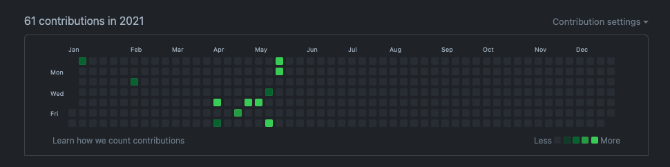
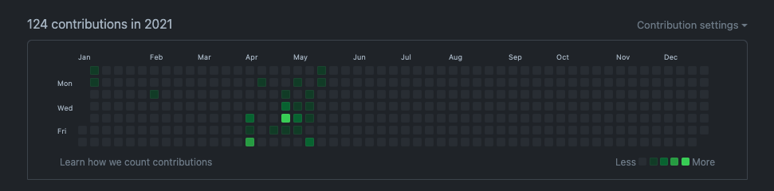

# 😭 커밋을 잃어버린 스토리

최근에 github contribution 그래프를 따로 체크하지 않고 있었다가

오랜만에 그래프를 확인해봤는데 텅텅 비어있었다;;;



`'읭!? 내 커밋들 다 어디갔어!!'`

원인을 찾아보니까 나의 github 계정은 `minhoe1122@gmail.com` 인데

반년동안 커밋된 Author를 확인해보니 회사 계정으로 커밋되고 있었다;;

커밋 하나하나를 건들여야하나 했지만 해결 방법을 찾았다 🥲

지금부터 잃어버린 나의 커밋을 찾아보겠다!!!!

# 🤗 그래프가 채워지는 조건은?!

- github 계정에 등록된 이메일 주소와 같아야한다.
- Fork된 Repository는 PR 후 Merge 되어야 그래프가 채워진다.
- Default, gh-pages 브랜치에 적용된 커밋만 해당한다.

# 🤩 방법 1: Github에 이메일 계정 추가

`제일 쉬운 방법이다!`

1. Github 로그인 ➡ Github Setting ➡ Emails 탭 이동
2. `Add email address`에 제 2의 계정 추가 후 Add 버튼을 클릭 하여 이메일 추가 (저는 회사 계정을 추가하였습니다!)
3. 추가한 계정으로 인증 메일이 전송됩니다! 해당 메일로 접속하여 인증버튼을 누릅니다~



`완료!` (해봤자 커밋이 얼마 안늘어난건 비밀... 🥵 열심히 살자...)

# 🥶 방법 2: 커밋 하나하나 찾아서 Autor 수정

`엄청나게 귀찮은 방법이다!`

- 아래의 경우가 아니라면 권장하지 않는다.
  - Author에 오타로 인해 이메일 인증할 수 없는 경우
  - Author를 수정할 커밋 수가 적은 경우
  - 혼자 사용하는 Repository인 경우

1. 수정할 커밋이 속한 Repository Clone

```bash
git clone ${Repository 주소}
cd ${Repository 이름}
```

2. 아래 스크립트 실행

```bash
git filter-branch --env-filter '
OLD_EMAIL="{예전 이메일}"
CORRECT_NAME="{현재 이름}"
CORRECT_EMAIL="{현재 이메일}"

if [ "$GIT_COMMITTER_EMAIL" = "$OLD_EMAIL" ]
then
  export GIT_COMMITTER_NAME="$CORRECT_NAME"
  export GIT_COMMITTER_EMAIL="$CORRECT_EMAIL"
fi

if [ "$GIT_AUTHOR_EMAIL" = "$OLD_EMAIL" ]
then
  export GIT_AUTHOR_NAME="$CORRECT_NAME"
  export GIT_AUTHOR_EMAIL="$CORRECT_EMAIL"
fi
' --tag-name-filter cat -- --branches --tags

```

3. master 브랜치 또는 default 브랜치 강제 push

```bash
git push -f origin master
# 또는
git push -f origin ${Default 브랜치 명}
```

`귀찮죠?!` 웬만하면 방법1을 사용합시다!

# 🥸 다들 본인의 커밋을 되찾길 바랍니다!

---

https://ndb796.tistory.com/265
