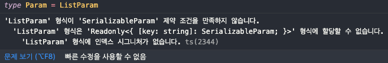

# 🥲 문제 발생 코드

```typescript
interface ListParam {
  page?: number;
  pageSize?: number;
  orderBy?: "DESC" | "ASC";
  sortBy?: string;
  total?: boolean;
}

type Param = ListParam;

export const listQuery = selectorFamily<Data[], Param>({
  key: "listQuery",
  get: (param) => async () => {
    const { data } = await getList(param);
    return data;
  },
});
```

- Data는 API 요청 후 반환되는 데이터 타입입니다.
- Param은 Recoil의 파라미터에 들어갈 타입 입니다.
- getList 함수는 api를 호출하는 함수 입니다.

# 🤨 에러 메세지

> "인덱스 시그니처가 없습니다." 라는 에러 메세지 발생



# 🧐 원인

```typescript
type Primitive = undefined | null | boolean | number | symbol | string;

export type SerializableParam =
  | Primitive
  | { toJSON: () => string }
  | ReadonlyArray<SerializableParam>
  | Readonly<{ [key: string]: SerializableParam }>;
```

[Recoil github 참고 링크](https://github.com/facebookexperimental/Recoil/blob/master/typescript/index.d.ts#L294)

- 위의 소스코드는 selectorFamily의 두번째 제네릭 타입에 해당하는 Parameter에 관련된 타입이다.
- 해당 타입으로 인하여 우리의 코드에서 에러가 발생하였다
- orderBy의 경우는 SerializableParam에 알맞지 않다. (Primitive 타입을 보면 `"DESC" | "ASC"` 같은 타입은 없다.)

# 🥸 조치 방법

```typescript
interface Param extends ListParam {
  // eslint-disable-next-line @typescript-eslint/no-explicit-any
  [key: string]: any;
}
```

- 해당 오류를 피해가기 위해 위와 같이 `ListParam`을 상속받아 인덱스 시그니처 속성을 추가해주었습니다.
- ESLint의 any 오류를 피해가기 위해 ignore 주석을 추가해주었습니다.

### 참고

https://yamoo9.gitbook.io/typescript/interface/index-signature
