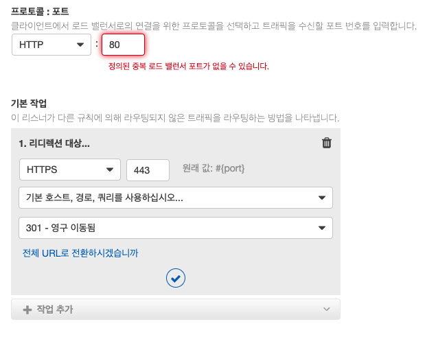

# 💁🏼‍♂️ 사전 조건

- 도메인 구입
- 인증서 발급

> 현 회사에서 이미 사용중인 도메인 & 인증서가 있어서 구매 및 발급 과정은 생략합니다.
>
> 참고: AWS route53에서 도메인 구입 가능합니다.
>
> 참고: AWS ACM에서 구입한 도메인의 SSL 인증서 발급이 가능합니다.

# 🎃 ELB에 https 리스너 추가

- EC2 콘솔 ➡ 로드밸런서 ➡ https 적용할 대상 선택 ➡ 리스터 탭 클릭 ➡ 리스너 추가
- 프로토콜 HTTPS 선택 및 포트 입력
- 전달 대상 선택 (대상 그룹을 선택합니다.)
- 보안 정책 및 인증서 선택

# 👾 http로 접속 시 https로 리다이렉트 시키기

- EC2 콘솔 ➡ 로드밸런서 ➡ https 적용할 대상 선택 ➡ 리스터 탭 클릭 ➡ 기종의 http 리스너 제거
- 리스너 추가
- 프로토콜 HTTP 선택 및 포트 입력
- 기본작업에서 "리다이렉션 대상..." 선택
- 포트 값 입력, "기본 호스트,경로,쿼리를 사용하십시오..." 선택, "301 - 영구이동됨" 선택
