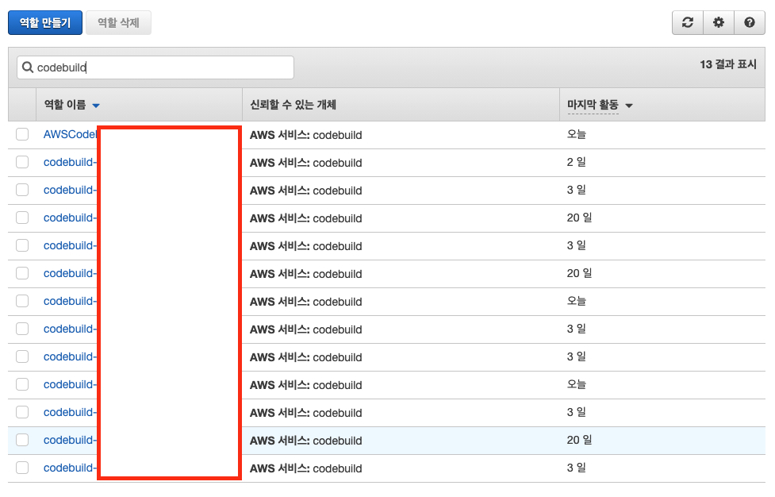
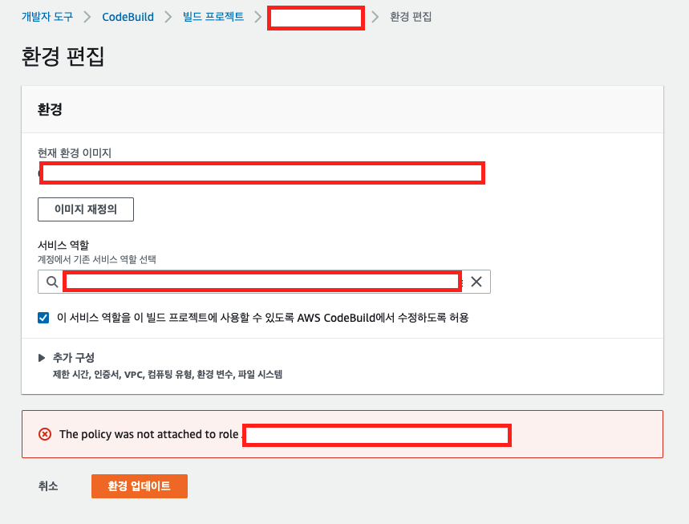

# 🌅 배경

- CodeBuild 서비스에서 빌드 프로젝트를 생성할 때 IAM Role을 임의로 지정해주지 않으면 새롭게 생성합니다.
- 따라서 임의로 지정해주지 않으면 아래와 같이 `codebuild-{빌드 프로젝트 명}` 형식의 IAM Role이 무수히 생성됩니다.
  
- 나중에 관리하기도 힘들고... 정책추가할 때 마다 하나하나씩 들어가서 직접 정책을 추가해줘야하는 번거로움이 있다.

> 이러한 이유로 하나의 IAM Role로 통합하기로 하였다!!

# 🚦 문제

- 기존에 있던 CodeBuild 프로젝트의 서비스 역할을 수정하려고 하니 아래와 같이 에러 메세지가 발생하였다...
  

> The policy was not attached to role {IAM Role 이름}

# 🤔 분석

- CodeBuild에서는 편리하게도 IAM Role을 연결해주면 CodeBuild 서비스에서 필요할때 원하는 Policy를 자동으로 추가해주는 기능이 있습니다.
  - 예를 들면 특정 VPC에서 빌드 인스턴스가 생성되길 원하는 경우에는 CodeBuild에서 자동으로 VPC 접근 Policy를 해당 Role에 자동으로 추가합니다.
- 단!!! CodeBuild 서비스를 통해서 만든 IAM Role에 한정해서 입니다.
- 따라서 IAM 콘솔에서 직접 생성한 Role으로 업데이트하는 경우에는 CodeBuild에서 직접 수정하기에 문제될 수 있기 때문에 위와 같은 에러가 발생합니다.

# 🤖 조치 방법

1. `이 서비스 역할을 이 빌드 프로젝트에 사용할 수 있도록 AWS CodeBuild에서 수정하도록 허용` 체크 해제 후 업데이트 합니다!!
   - 
   - 이런 경우에는 자동으로 Policy를 추가할 수 는 없습니다~!
2. CodeBuild 프로젝트를 새로 만들면서 통합하려는 IAM Role을 Attach 하는 방법이 있습니다.
