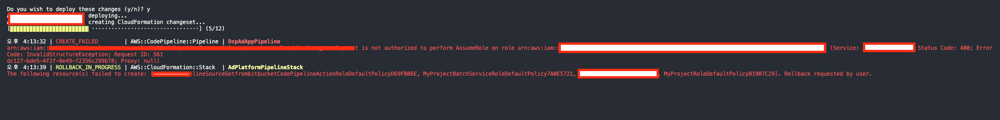
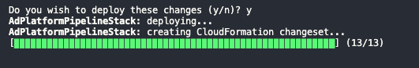

# 🤡 사전 조건, 배경 및 목표

- CodePipeline에서 통합하여 사용할 IAM Role은 이미 생성되어 있음
- 공용 Artifact Store로 사용할 S3 버킷 생성되어 있음
- 위에서 미리 만들어진 Role 및 S3 Bucket을 사용하여 Code Pipeline을 CDK로 생성
- 소스는 TypeScript로 작성되었습니다.
- 소스 상의 ARN은 임의로 만든 값입니다. (공개할수는 없잖아요!)

# 👹 소스코드 설명

## 1. IAM Role ARN으로 불러오기

```typescript
import * as iam from "@aws-cdk/aws-iam";

const CODEPIPELINE_ROLE_ARN =
  "arn:aws:iam::000000000000:role/service-role/AWSCodePipelineServiceRole";

export class AdPlatformPipelineStack extends cdk.Stack {
  constructor(scope: cdk.Construct, id: string, props?: cdk.StackProps) {
    super(scope, id, props);

    // ...
    const role = iam.Role.fromRoleArn(this, "Role", CODEPIPELINE_ROLE_ARN, {
      mutable: false,
    });
    // ...
  }
}
```

- `aws-iam` 패키지의 `fromRoleArn` 함수는 IAM Role의 ARN 값으로 이미 존재하는 IAM Role의 값을 불러옵니다.
- `mutable` 속성은 AWS Managed Service가 해당 IAM Role을 수정 가능한지 여부에 대한 옵션입니다. (default: true, true = 수정 가능, false = 수정 불가능)
  - [바로가기](https://github.com/aws/aws-cdk/blob/master/packages/%40aws-cdk/aws-iam/lib/role.ts#L148)
  - 예를 들면 CodePipeline CDK에서 IAM Role에 Policy를 추가하려는데 false로 되어있다면 수정이 불가능해집니다.

## 2. Artifact Store(S3) 불러오기

```typescript
import * as s3 from "@aws-cdk/aws-s3";

export class AdPlatformPipelineStack extends cdk.Stack {
  constructor(scope: cdk.Construct, id: string, props?: cdk.StackProps) {
    super(scope, id, props);

    // ...
    const artifactBucket = s3.Bucket.fromBucketName(this, "store", "artifact");
    // ...
  }
}
```

- `artifact`라는 Bucket 명을 가진 S3의 객체를 불러오는 코드 입니다.

## 3. CodePipeline Action 생성

```typescript
import * as codepipeline_actions from "@aws-cdk/aws-codepipeline-actions";
import * as codebuild from "@aws-cdk/aws-codebuild";

export class AdPlatformPipelineStack extends cdk.Stack {
  constructor(scope: cdk.Construct, id: string, props?: cdk.StackProps) {
    super(scope, id, props);

    // ...
    const sourceOutput = new codepipeline.Artifact("Source");
    const sourceAction =
      new codepipeline_actions.CodeStarConnectionsSourceAction({
        actionName: "Get_from_bitbucket",
        owner: "myOrgan",
        repo: "myRepo",
        branch: "develop",
        output: sourceOutput,
        codeBuildCloneOutput: false,
        connectionArn:
          "arn:aws:codestar-connections:ap-northeast-2:000000000000:connection/aaaaaaaa-aaaa-aaaa-aaaa-aaaaaaaaaaaa",
      });

    const project = new codebuild.PipelineProject(this, "MyProject");
    const buildOutput = new codepipeline.Artifact("Build");
    const buildAction = new codepipeline_actions.CodeBuildAction({
      actionName: "CodeBuild",
      project,
      input: sourceOutput,
      outputs: [buildOutput],
      executeBatchBuild: true,
    });
    // ...
  }
}
```

- CodePipeline을 만들기 위해서는 2개의 유효한 Stage가 필요합니다.
- 위는 각각 아래와 같은 과정입니다.
  - CodeStar 서비스를 이용하여 Bitbucket에서 SourceArtifact(`sourceOutput`)를 받아오는 과정
  - SourceArtifact로 CodeBuild 프로젝트를 만드는 과정

## 4. CodePipeline 생성

```typescript
import * as codepipeline from "@aws-cdk/aws-codepipeline";

export class AdPlatformPipelineStack extends cdk.Stack {
  constructor(scope: cdk.Construct, id: string, props?: cdk.StackProps) {
    super(scope, id, props);

    // ...
    const pipeline = new codepipeline.Pipeline(this, "CdkPipeline", {
      pipelineName: "cdk-pipeline",
      role,
      artifactBucket,
    });

    pipeline.addStage({ stageName: "Source", actions: [sourceAction] });
    pipeline.addStage({ stageName: "Build", actions: [buildAction] });
    // ...
  }
}
```

- 이전에 생성한 Action들을 각 Stage에 매칭 합니다.

# 👺 에러 메세지



```
오후 4:13:32 | CREATE_FAILED        | AWS::CodePipeline::Pipeline | CodePipeline
arn:aws:iam::000000000000:role/service-role/AWSCodePipelineServiceRole is not authorized to perform AssumeRole on role arn:aws:iam::000000000000:role/CodePipelineStack-CodePipelineSourceGetf-11JMISA1AX433 (Service: AWSCodePipeline; Status Code: 400; Error Code: InvalidStructureException; Request ID: 561
dc127-bde5-4f2f-8e49-f2356c299b78; Proxy: null)
```

- 요약하자면 CodePipeline에 연결한 IAM Role은 CodePipeline에서 변경이 불가능하다는 이야기 이다.

# 👾 해결 방법

- 정말 간단하다... 문제가 된 이유는 앞서 말했던 `fromRoleArn` 함수의 `mutable` 속성을 false로 설정하여 문제가 되었다.
  - 이래서 CDK에서 IAM Role에 Policy를 추가할 수 없음.
- 아래와 같이 `fromRoleArn` 함수의 `mutable` 속성을 제거해주면 된다. (default가 true 라서 지우기만 하면 된다.)

```typescript
const role = iam.Role.fromRoleArn(this, "Role", CODEPIPELINE_ROLE_ARN);
```

- 성공 결과이다!
  

- Option들 좀 자세히 잘보자!!!
  - Example 코드를 보고 그대로 가져왔는데 mutable 속성에 대한 설명을 좀 대충 보았다...
  - 이거때문에 한 15분은 버린거 같다...
