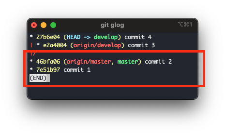
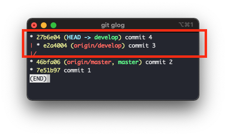
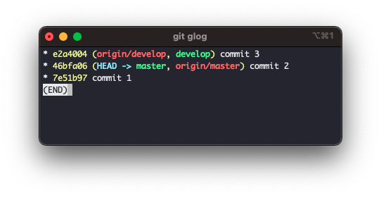
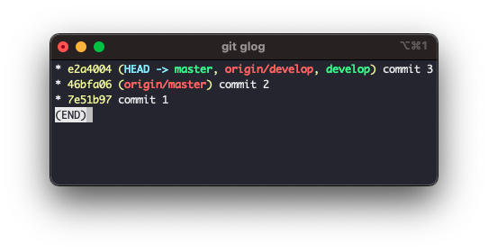
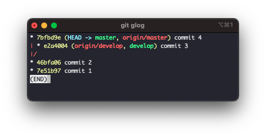
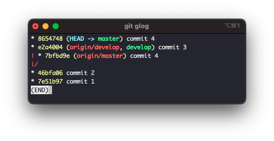
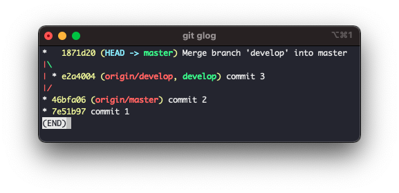
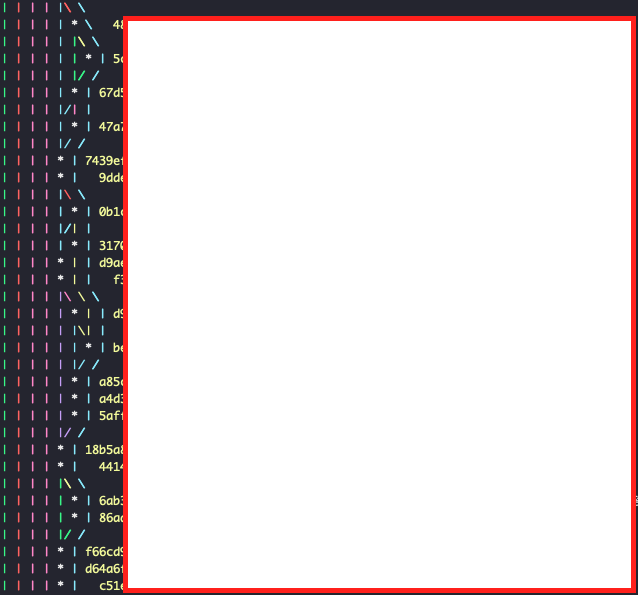

# 목차

- [목차](#목차)
- [🤓 개요](#-개요)
- [🥶 중요 개념: Fast-Forward 관계란?](#-중요-개념-fast-forward-관계란)
- [🥸 merge와 rebase의 기본 개념 및 차이](#-merge와-rebase의-기본-개념-및-차이)
- [😇 merge, rebase 사용 케이스](#-merge-rebase-사용-케이스)
  - [1. Fast-Forward 관계에서 merge](#1-fast-forward-관계에서-merge)
  - [2. Fast-Forward 관계에서 rebase](#2-fast-forward-관계에서-rebase)
  - [3. Fast-Forward 관계가 아닐때 merge](#3-fast-forward-관계가-아닐때-merge)
  - [4. Fast-Forward 관계가 아닐때 rebase](#4-fast-forward-관계가-아닐때-rebase)
  - [5. Fast-Forward 관계에서 merge (with merge message)](#5-fast-forward-관계에서-merge-with-merge-message)
- [🤔 정리하자면...](#-정리하자면)

# 🤓 개요

- 사전적으로 "merge는 합치다", "rebase는 재배치하다" 라는 뜻을 가지고 있습니다.
- 영어로는 쉽지만 git을 이용할 때 헷갈리는 경우가 있죠
- 이번 포스팅에서는 merge와 rebase의 차이를 알아보고 각 케이스별로 예시를 알아볼 예정입니다.

# 🥶 중요 개념: Fast-Forward 관계란?

> Fast-Forward 관계란 쉽게 말해서 자손관계 여부를 말합니다

| Fast-Forward 관계가 맞는 경우                | Fast-Forward 관계가 아닌 영우                    |
| -------------------------------------------- | ------------------------------------------------ |
|                       |                           |
| `commit 1`과 `commit 2`는 자손 관계          | `commit 3`과 `commit 4`는 자손 관계가 아님       |
| 이런 경우를 Fast-Forward 관계 라고 부릅니다. | 이런 경우를 Fast-Forward 관계가 아니라고 합니다. |

# 🥸 merge와 rebase의 기본 개념 및 차이

- A는 현재 브랜치 또는 커밋을 말합니다.
- B는 merge 또는 rebase 대상이되는 브랜치 또는 커밋을 말합니다.

|            | 설명                           | 명령어                            | 그래프                |
| ---------- | ------------------------------ | --------------------------------- | --------------------- |
| A merge B  | B를 유지하고 A의 내용을 재배치 | `git checkout A` ➡ `git rebase B` | 세모 또는 네모 만들기 |
| A rebase B | A에 B를 합침                   | `git checkout A` ➡ `git merge B`  | 일자 만들기           |

- 세모 만들기 / 일자 만들기는 뒤에 있는 케이스를 보면 보다 쉽게 이해 할 수 있습니다.

# 😇 merge, rebase 사용 케이스

## 1. Fast-Forward 관계에서 merge

| merge 전                | merge 후                |
| ----------------------- | ----------------------- |
|  |  |

```bash
git checkout master
git merge develop
```

- `commit 1`과 `commit 2`가 Fast-Forward 관계 입니다.
- 이러한 관계에서는 merge 커밋이 추가적으로 생기지 않고 조상 commit을 따라가기만 합니다.
- merge를 하였지만 사실상 rebase된 것과 마찬가지 입니다.
- 그래프를 보면 일자를 유지하는 것을 볼 수 있습니다.

## 2. Fast-Forward 관계에서 rebase

| rebase 전               | rebase 후               |
| ----------------------- | ----------------------- |
|  |  |

```bash
git checkout master
git rebase develop
```

- `commit 1`과 `commit 2`가 Fast-Forward 관계 입니다.
- 앞서 개념 설명에서 말할 것과 같이 `B(develop)`를 유지하면서 `A(master)`를 변경시키기 때문에 조상 commit을 따라가기만 합니다.
- 그래프를 보면 일자를 유지하는 것을 볼 수 있습니다.

## 3. Fast-Forward 관계가 아닐때 merge

| merge 전                | merge 후                |
| ----------------------- | ----------------------- |
|  |  |

```bash
git checkout master
git merge develop
```

- `commit 1`과 `commit 2`가 Fast-Forward 관계가 아닙니다.
- 이런 경우는 merge 커밋과 함께 커밋이 합쳐집니다.
- 그래프를 보면 세모/네모의 형태로 만들어지는 것을 볼 수 있습니다.

## 4. Fast-Forward 관계가 아닐때 rebase

| rebase 전               | rebase 후               |
| ----------------------- | ----------------------- |
|  |  |

```bash
git checkout master
git merge develop
```

- `commit 1`과 `commit 2`가 Fast-Forward 관계가 아닙니다.
- 앞서 개념 설명에서 말할 것과 같이 `B(develop)`를 유지하면서 `A(master)`를 변경시키기 때문에 A를 B의 조상으로 만들어 줍니다.
  - 따라서 `commit 3`위에 `commit 4`가 재배치 되는 것을 볼 수 있습니다.
- 그래프를 보면 세모/네모의 형태로 만들어지는 것을 볼 수 있습니다.

## 5. Fast-Forward 관계에서 merge (with merge message)

| merge 전                | merge 후                |
| ----------------------- | ----------------------- |
|  |  |

```bash
git checkout master
git merge --no-ff develop
```

- `commit 1`과 `commit 2`가 Fast-Forward 관계 입니다.
- 이러한 관계에서는 merge 커밋이 추가적으로 생기지 않고 조상 commit을 따라가지만 `--no-ff` 옵션을 통하여 강제적으로 merge commit 과 함께 병합할 수 있습니다.
- 그래프를 보면 세모/네모의 형태로 만들어지는 것을 볼 수 있습니다.

# 🤔 정리하자면...

- 개발자인 지인 형한테 들었는데 네이버 웹툰에서 전화 면접볼때 git rebase와 merge의 차이를 물어보는 질문을 받았다고 들었습니다.
  - 알아두면 좋을거같아요 ^^..
- 저만의 이해법이긴 하지만 저는 merge와 rebase의 차이는 그래프 만들기에 있다고 생각합니다.
- 왜냐하면 두 기능 모두 현재 브랜치에 다른 브랜치 또는 커밋을 적용한다는 같은 목적을 가지고 있거든요
- 이때 merge와 rebase는 그래프를 그릴때 일자로 만들지 세모/네모로 만들지 차이가 있습니다.
  - 둘중에 뭐가 좋다고 단정지을 수 없어요! 아래와같은 경우가 있거든요
  - merge 커밋이 너무 많아 지는 경우 그래프의 두깨가 넓어질때가 있어요
    <details><summary>접기/펼치기!!</summary><div markdown="1">예전 회사의 커밋이에요... 너무 두꺼워서 추적하기 어려울때가 있어요
      
      </div>
    </details>
  - 여러명이 하나의 repository에서 개발할때 너무 rebase를 지향하다보면 그래프로 한번에 분간하기 어려워져요!
- 그래서 저는 아래와 같이 이해합니다.
  - merge/rebase 모두 현재 브랜치에 다른 브랜치의 소스를 적용하는 방법이다.
  - merge는 merge commit message와 함께 그래프에서 세모 또는 네모를 그린다.
  - rebase는 그래프에서 일자를 그린다.

> 사실상 merge 하나만 있어도 문제 없지만... 그래프를 통하여 소스 추적을 하는 사람을 배려하기 위해서 rebase가 만들어지지 않았을까요? 😁

> 다음 시간에는 업무의 상황별로 merge와 rebase를 사용하는 케이스를 만들어볼게요 ㅎㅎ
