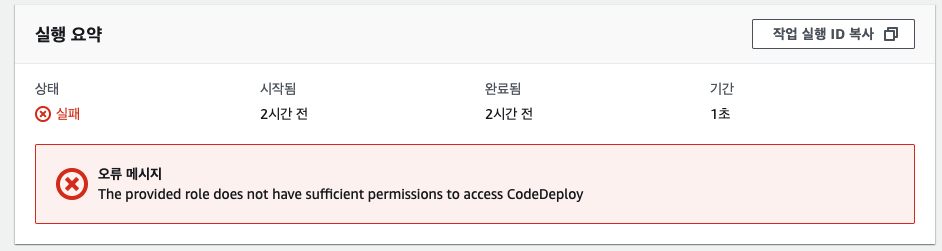

# 👾 개요 및 오류 메세지

AWS CDK로 CodePipeline을 소스코드화 시키는 작업 중 아래와 같은 에러가 발생하였다.

> The provided role does not have sufficient permissions to access CodeDeploy



다음은 오류가 발생한 cdk 코드이다. (TypeScript)

# 💁🏼‍♂️ 소스코드

<details>
<summary>접기/펼치기!!</summary>
<div markdown="1">

```typescript
import * as cdk from "@aws-cdk/core";
import * as iam from "@aws-cdk/aws-iam";
import * as s3 from "@aws-cdk/aws-s3";
import * as ec2 from "@aws-cdk/aws-ec2";
import * as codepipeline from "@aws-cdk/aws-codepipeline";
import * as codepipeline_actions from "@aws-cdk/aws-codepipeline-actions";
import * as codebuild from "@aws-cdk/aws-codebuild";
import * as codedeploy from "@aws-cdk/aws-codedeploy";
import * as cloudwatch from "@aws-cdk/aws-logs";

const POSTFIX_STR = "_by-cdk";

export class PlatformPipelineStack extends cdk.Stack {
  constructor(scope: cdk.Construct, id: string, props?: cdk.StackProps) {
    super(scope, id, props);

    const role = iam.Role.fromRoleArn(
      this,
      "Role",
      process.env.CODEPIPELINE_ROLE_ARN || ""
    );

    const artifactBucket = s3.Bucket.fromBucketName(
      this,
      "ArtifactStore",
      "motov-artifact-store"
    );

    const sourceOutput = new codepipeline.Artifact("Source");
    const sourceAction =
      new codepipeline_actions.CodeStarConnectionsSourceAction({
        actionName: "Get_from_bitbucket",
        owner: "motov-sw",
        repo: "dsp-ad-app",
        branch: "develop",
        output: sourceOutput,
        codeBuildCloneOutput: false,
        triggerOnPush: false,
        connectionArn: process.env.CODESTAR_CONN_ARN || "",
      });

    const buildRole = iam.Role.fromRoleArn(
      this,
      "BuildRole",
      process.env.CODEBUILD_ROLE_ARN || ""
    );
    const project = new codebuild.PipelineProject(this, "BuildApp", {
      projectName: `build_dsp-ad-app${POSTFIX_STR}`,
      buildSpec: codebuild.BuildSpec.fromSourceFilename(
        "configuration/buildspec_develop.yml"
      ),
      role: buildRole,
      environment: {
        buildImage: codebuild.LinuxBuildImage.STANDARD_5_0,
        computeType: codebuild.ComputeType.MEDIUM,
        privileged: true,
      },
      logging: {
        cloudWatch: {
          logGroup: new cloudwatch.LogGroup(this, "BuildLog"),
          enabled: true,
        },
      },
      vpc: ec2.Vpc.fromLookup(this, "VPC", { vpcName: "Platform" }),
      subnetSelection: {
        subnets: [
          ec2.Subnet.fromSubnetId(this, "DevelopA", "subnet-aaaaaaaaaaaaaaaaa"),
          ec2.Subnet.fromSubnetId(this, "DevelopC", "subnet-ccccccccccccccccc"),
        ],
      },
      securityGroups: [
        ec2.SecurityGroup.fromLookup(
          this,
          "DefaultSecurityGroup",
          "sg-00000000000000000"
        ),
      ],
    });
    const buildOutput = new codepipeline.Artifact("Build");
    const buildAction = new codepipeline_actions.CodeBuildAction({
      actionName: "BuildAll",
      project,
      input: sourceOutput,
      outputs: [buildOutput],
    });

    const deployToDevAction =
      new codepipeline_actions.CodeDeployServerDeployAction({
        actionName: "DeployToDevelop",
        input: buildOutput,
        deploymentGroup:
          codedeploy.ServerDeploymentGroup.fromServerDeploymentGroupAttributes(
            this,
            "DeployGroup",
            {
              application:
                codedeploy.ServerApplication.fromServerApplicationName(
                  this,
                  "DeployApplication",
                  "Platform"
                ),
              deploymentGroupName: "develop_app",
            }
          ),
      });

    const pipeline = new codepipeline.Pipeline(this, "AppPipeline", {
      pipelineName: `app${POSTFIX_STR}`,
      role,
      artifactBucket,
    });

    pipeline.addStage({ stageName: "Source", actions: [sourceAction] });
    pipeline.addStage({ stageName: "Build", actions: [buildAction] });
    pipeline.addStage({ stageName: "Deploy", actions: [deployToDevAction] });
  }
}
```

</div>
</details>

- 각종 ID 들은 임의로 바꿔두었습니다!
- 유효하지 않은 ID들이에요

# 🥸 원인 분석 및 조치 방법

- 오류 메세지에서 알 수 있듯이 원인은 CodeDeploy를 실행하는데 권한이 부족하다는 의미 입니다.
- 처음에 콘솔로 설정할때랑 권한(IAM Role)이 같다고 생각했는데
- CDK에서 CodePipeline 개발 시에는 Pipeline Action의 role도 신경 써줘야 한다는 것을 알았습니다.
- 따라서 아래와 같이 Deploy Action 수정하였습니다.

  - CodePipeline Action에 CodePipeline에서 쓰던 Role을 같이 추가해주니 해결 되었습니다.!

```typescript
// ...
const deployToDevAction = new codepipeline_actions.CodeDeployServerDeployAction({
  // ...
  deploymentGroup: codedeploy.ServerDeploymentGroup.fromServerDeploymentGroupAttributes(
    this,
    role: iam.Role.fromRoleArn(this, "Role", "ARN ID!!!");
    // ...
  ),
});
// ...
```
