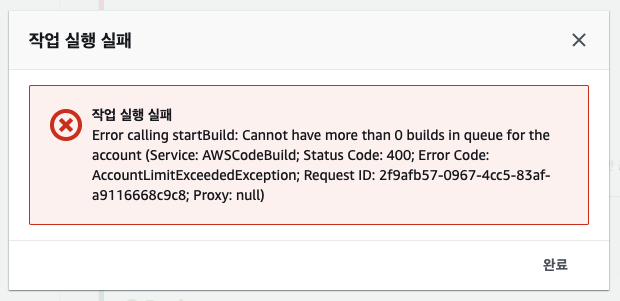
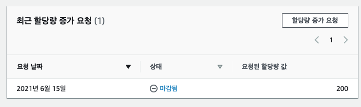

# 👾 개요

- 열심히 기존에 운영하던 CodePipeline을 CDK로 옮기는 작업 중 아래와 같은 에러가 발생했다.
  

```
Error calling startBuild: Cannot have more than 0 builds in queue for the account
(Service: AWSCodeBuild;
Status Code: 400;
Error Code: AccountLimitExceededException;
Request ID: f0eca668-cd8e-4a4a-8a93-ed28f2e24305;
Proxy: null)
```

- 위 사항이 발생하기까지 아래와 같은 환경을 가지고 있었다.
- 최근에 CDK를 통해서 CodePipeline을 소스로 전환 중에 있음.
- 최근에 CodePipeline 실행 수가 많음.

# 🚦 원인 분석

- 오류 내용을 보면 알 수 있듯이 AWS Account 마다 CodeBuild 실행 수에 대한 제한이 있는 것으로 보였다. ([해당 문서의 Build failed to start 참고](https://docs.aws.amazon.com/codebuild/latest/userguide/troubleshooting.html#troubleshooting-build-failed-to-start))
- 동시 빌드 제한 수를 늘려야한다! (Maximum number of concurrently running builds)

# 🤖 조치 방법

- [참고 링크](https://docs.aws.amazon.com/codebuild/latest/userguide/limits.html)

1. Service Quotas 콘솔 접속 (리전 선택 주의!!!)
   - [접속 링크](https://console.aws.amazon.com/servicequotas/home/services/codebuild/quotas/L-75822022)
   - [한국 리전으로 바로 접속 링크](https://ap-northeast-2.console.aws.amazon.com/servicequotas/home/services/codebuild/quotas/L-75822022)
2. 할당량 증가 요청
3. 변경할 값 입력 후 요청 (저는 기본값의 두배인 120으로 요청했음)
4. 완료 까지 대기...
   - 저는 약 하루 걸렸습니다.
   - 완료 시 화면
     
