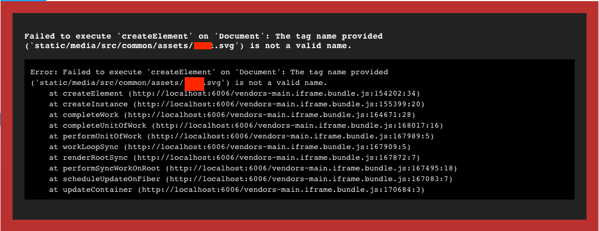
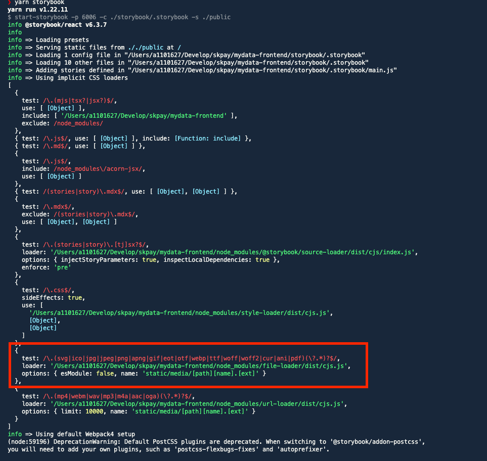

# 🤔 증상



- svg 파일을 로드하는 컴포넌트를 Storybook에서 불러왔으나 위와 같은 메세지가 발생하였다.
- 바쁘신 분은 바로 😀 조치 사항 확인

# 🧐 원인

## 1. svg 파일 로드를 위한 패키지 설치

> webpack에서 svg 파일을 로드하기 위해서 아래 패키지를 설치하였다.

```bash
npm install -D @svgr/webpack
# 또는
yarn add -D @svgr/webpack
```

## 2. 기존의 storybook의 main.js의 webpack 설정 소스 코드

> svg 파일을 로드하기 위해서는 webpack 설정이 선행 되어야하고 본인은 아래와 같이 설정하였음.

```javascript
module.exports = {
  webpackFinal: async (config) => {
    config.module.rules.unshift({
      test: /\.svg$/,
      use: ['@svgr/webpack'],
    });
    return config;
  },
};
```

- 기존의 rule에서 svg 확장자로 끝나는 파일에 대하여 `@svgr/webpack`을 통하여 로드하도록 설정한 것이다.
- JavaScript의 `unshift`를 사용하면 Array의 제일 처음에 삽입됨
- Webpack의 Rule이 순차적으로 적용되는 것으로 생각하고 위와 같이 설정 (사실 서칭을 통해서 복붙한 것;;ㅋ)

## 3. 원인을 찾기 위해 main.js를 아래와 같이 수정

```javascript
module.exports = {
  webpackFinal: async (config) => {
    console.log(config.module.rules);
    config.module.rules.unshift({
      test: /\.svg$/,
      use: ['@svgr/webpack'],
    });
    return config;
  },
};
```

- webpack rule을 확인하기 위하여 `console.log`를 찍은 화면

## 4. storybook 실행 후 아래와 같은 로그 발생



- webpack rule을 확인해보니 위와 같이 svg 확장자에 대한 다른 룰이 적용되는 것을 확인하였음

## 5. 임시로 조치하여 정상 동작 확인

```javascript
module.exports = {
  webpackFinal: async (config) => {
    console.log(config.module.rules);
    config.module.rules[config.module.rules.length - 2].test =
      /\.(ico|jpg|jpeg|png|apng|gif|eot|otf|webp|ttf|woff|woff2|cur|ani|pdf)(\?.*)?$/;
    config.module.rules.unshift({
      test: /\.svg$/,
      use: ['@svgr/webpack'],
    });
    return config;
  },
};
```

- 위와 같이 file-loader에서 파일을 검사하는 test regex에서 svg 확장자만 제외하였더니 svg 로딩이 되는 것을 확인했다.
- array의 순서는 제가 원인 파악을 위해서 임의로 사용하였습니다. (설정에 따라서 rule의 순서가 다를 수 있습니다.)

# 😀 조치

```javascript
module.exports = {
  webpackFinal: async (config) => {
    const rules = config.module.rules;
    const fileLoaderRule = rules.find((rule) => rule.test.test('.svg'));
    fileLoaderRule.exclude = /\.svg$/;

    rules.push({
      test: /\.svg$/,
      use: ['@svgr/webpack'],
    });

    return config;
  },
};
```

- 위와 같이 svg 확장자로 검사하는 rule을 찾아 exclude 옵션을 통하여 검사에서 제외하도록 하였습니다.
- 위의 소스코드는 svg 검사하는 rule 하나만 찾아서 exclude 시키지만 여러개의 rule일 수 있으니 때에 따라서 여러번 찾아서 exclude 시켜줘야 할 수 있습니다.
