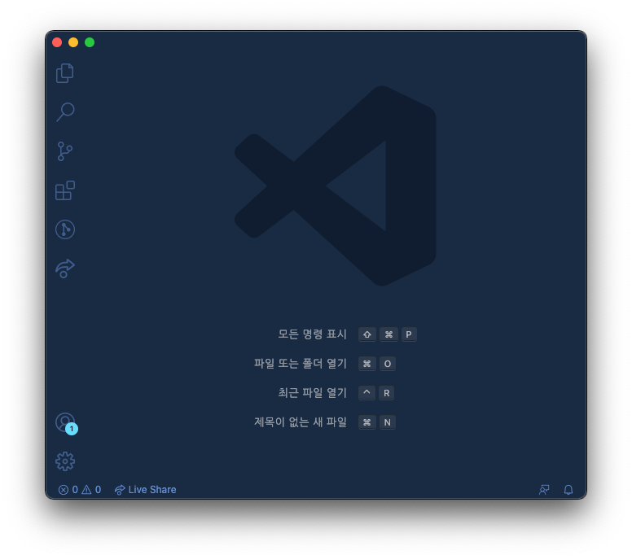

위는 현재 개발 PC에서 VS Code를 실행하면 보이는 모습이다.

현 회사에서는 Software 지원이 빵빵해서 VS Code와는 이별하고
(~~나 다시 돌아갈 수도 있어...~~)

전부터 사용하고 싶었던 Web Storm을 사용해보려고 한다.

나름 오래 사용했던 VS Code이기에 아쉬운 마음에 나의 IDE/Editer의 발자취를 돌아보려고 한다.

# 🧑🏼‍💻 나의 IDE/Editer의 역사

## 👶🏼 Visual Studio 2008/2012

- 사용 시기: 대학교 1학년 ~ 3학년 1학기

나의 첫 IDE다.

첫 Programming Language가 C/C++라서 자연스럽게 사용했다.

기억이 희미하지만 Visual Studio 2008 이전 버전을 사용하다가

2012를 사용하면서 `scanf` 함수를 사용할때면 취약하다고

`scanf_s` 함수를 사용하라고 하던 컴파일 메세지가 생각난다.

오늘(21/10/20) 기준으로 [Visual Studio 2022](https://visualstudio.microsoft.com/)가 최신버전으로 출시되어있다.

(아이유 2011년 너랑 나 발매 시)

~~2011년 쯤 릴리즈 되었을테니 `Visual Studio 2012`과 `아이유의 너랑 나`의 나이는 같다.~~
Visual Studio 2012는 12.08에 출시되었다;;

> 🤔 기억나는 수업: 컴퓨터 언어/컴퓨터 언어 실습, 자료구조, 운영체제 등

## 👦🏼 [Notepad++](https://notepad-plus-plus.org)

- 사용시기: 대학교 3학년 2학기

첫 IDE가 Visual Studio였다면

나의 첫 개발 장비(노트북)은 삼성에서 출시한 울트라북 시리즈5 였다.

15년도 2학기 복학 후 Visual Studio를 쓰려니 노트북이 힘들어했다.

3학년 2학기들어서 연구실로 학부연구생을 하고 Nodepad++라는 가벼운 Text Editer를 알게되었다.

당시 Samba(SMB)를 사용하여 CentOS로 구축한 원격 서버와 파일을 동기화하고 shell 접속 후

gcc/make를 통해서 빌드를 했기 때문에 굳이 무거운 Visual Studio를 사용할 필요가 없었다.

> 🤔 기억나는 프로젝트: Packet 검출 정확도 탐지 분석

## 😎 [VIM](https://www.vim.org/)

- 사용 시기: 대학교 3학년 2학기 ~ 4학년/인턴

_간 지_

VIM에 대해서 두단어로 표현하자면 이렇다.

간지를 빼도 너무 편하다.

(오죽하면 VS Code 넘어가서도 VIM Key mapping을 사용했다.)

당시에 네트워크 관리 연구실로 학부연구생을 시작했었는데

연구실 선택한 큰 이유 중 하나는 Linux 환경에서 네트워크 패킷 분석하는 프로젝트가 많았고

그 씨꺼먼 화면에서 VIM으로 개발하는 Linux C Developer는 너무 나도 `간.지.` 났기 때문이다.

이때부터 터미널 꾸미기에 관심을 가졌고 몇몇 VIM 테마와 Bundle은 내가 반하기에는 충분했다.

(나에게 ctag, cscope는 혁명이였다. 나에게 신세계를 알려주고 개발자로 애고를 쌓게해준 재무형에게 감사)

- 추천 Theme, Bundle (설명은 생략한다.)
  - https://github.com/Shougo/neocomplete.vim
  - https://github.com/nanotech/jellybeans.vim
  - https://github.com/nathanaelkane/vim-indent-guides
  - https://github.com/tomtom/tcomment_vim

(사진은 VIM 아니다)

> 🤔 기억나는 프로젝트: Package Generator, ~~NAC의 많은 서비스들~~

## 🧑🏼 [Visual Studio Code](https://code.visualstudio.com/)

- 사용 시기: 2017 ~ 2021

WEB 개발을 시작한 2017년 말 부터 VS Code를 사용헀다.

개발 장비 성능이 좋아진 것도 있지만 상대적으로 가볍고 (무겁게 사용할 수도 있다.^^;;)

큰 커뮤니티, 확장 앱, 호환되는 다양한 언어들... 거기다가 무.료.

뭐하나 안빠진 곳이 없다.

새로운 기분을 맛보기 위해서 몇번씩을 초기화하고 새롭게 설정한 경험이 많다.

사실상 나의 취업 라이프 싸이클을 동고동락한 친구인데 헤어진다니 아쉽다.

- 블로그 주인장의 VS Code 세팅: https://minemanemo.tistory.com/163

> 🤔 같이 지낸 기술들: C/C++, Docker, JS, TS, ExtJS, React, Bash, Python, 각종 스크립트 및 설정 파일

## 👨🏼 [Web Storm](https://www.jetbrains.com/ko-kr/webstorm/)

- 사용 시기: 2021 ~

Jetbrains에서 만든 Web Storm이다.

Jetbrains은 IDE의 끝판왕 제품만 취급하기 때문에

(비교적 최근에 Eclipse를 사용하다가 Jetbrains의 IntelliJ로 넘어간 Java 개발자 형이 있다)

항상 사용은 해보고 싶었지만 무료도 아닌거에 너무 익숙해져버리면 어쩌지라는 마음에 사용안했지만

현 회사에서 라이선스를 제공해주는 것을 알았고 설치하였다.

추후에 Web Storm 세팅 관련된 포스팅도 해보려고 한다.

## 🍝 이외 찍먹

Pycharm, Android Studio, sublimeText

# 👾 정리

시간이 많이 지났다.

위에 그 동안 사용했던 IDE를 나열해보니

단순히 IDE를 쓰면서 편했던 기억 외에도

그 당시에 있었던 일들이 기억난다.

아직 개발자로 일을 시작한지 5년차 밖에 되지 않았지만

앞으로 더 많은 기억과 경험을 IDE에 녹여보고 싶다.
