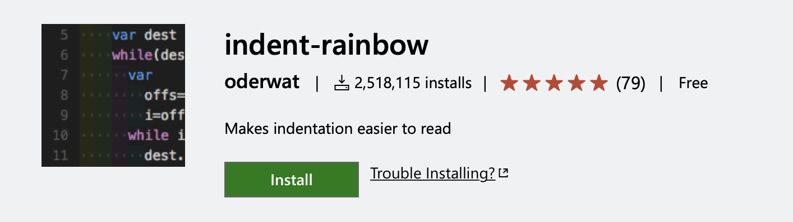

# 개요

Web Storm으로 갈아타기 전에 나의 VS Code 마지막 모습을 포스팅 하려고 한다.

참고로 나는 Front-End 개발을 하고 있기에 JavaScript 기반의 세팅이다.

---

# VS Code 설정 및 확장 앱

## 최고의 관종 앱: [Power Mode](https://marketplace.visualstudio.com/items?itemName=hoovercj.vscode-power-mode)


최고의 관종 앱.

keyboard 입력이 있을 때마다 팡팡 터지는 effect 때문에 심심하지 않다.
(개인적으로 흔들리는 옵션은 머리아파서 disable 했다.)

이걸 쓰고 있으면 사람들이 뭐냐고 물어본다. (~~물어볼때마다 짜릿함~~)

아래는 내가 사용하는 setting

```json
{
  // power mode
  "powermode.enabled": true,
  "powermode.presets": "fireworks",
  "powermode.enableShake": false,
  "powermode.enableStatusBarComboCounter": false,
  "powermode.enableStatusBarComboTimer": false
}
```

---

## Color Theme: [ReUI](https://marketplace.visualstudio.com/items?itemName=barrsan.reui)


[ReUI](https://marketplace.visualstudio.com/items?itemName=barrsan.reui)는 React의 컬러 테마를 베이스로 만든 Theme이다. (뭔가 React 쓸때 React스럽다?)

---

## Icon Theme: [Material Icon Theme](https://marketplace.visualstudio.com/items?itemName=PKief.material-icon-theme)


[Material Icon Theme](https://marketplace.visualstudio.com/items?itemName=PKief.material-icon-theme)는 아이콘을 예쁘게 만들어 준다.


위와 같이 많이 있는데 링크 들어가보면 위 사진 보다 아이콘이 다양하다. 기본 아이콘보다 훨신 예쁘다!

---

## [Auto Complete Tag](https://marketplace.visualstudio.com/items?itemName=formulahendry.auto-complete-tag)


html, jsx 개발 시 도움을 주는 확장이다.

이 앱에는 앞쪽 태그를 수정하면 뒤쪽 태그도 같이 수정하게 해주는 `Auto Rename Tag`와 태그를 닫으면 자동으로 Close 태그를 생성해주는 `Auto Close Tag`가 포함된 패키지이다.

아래는 내가 사용하는 setting이다.
원하는 확장자만 해당 기능을 enable/disable 시킬 수 있다.

```json
{
  "auto-rename-tag.activationOnLanguage": [
    "html",
    "javascript",
    "javascriptreact",
    "markdown",
    "mdx",
    "php",
    "plaintext",
    "typescript",
    "typescriptreact",
    "vue",
    "xml"
  ],
  "auto-close-tag.enableAutoCloseTag": true,
  "auto-close-tag.activationOnLanguage": [
    "html",
    "javascript",
    "javascriptreact",
    "markdown",
    "mdx",
    "php",
    "plaintext",
    "typescript",
    "typescriptreact",
    "vue",
    "xml"
  ]
}
```

---

## [Bracket Pair Colorizer](https://marketplace.visualstudio.com/items?itemName=CoenraadS.bracket-pair-colorizer)


아래처럼 Bracket(괄호)가 여러개 중첩될 시 서로 다른 색으로 구분하여 헷갈리는걸 방지해주는 앱이다.

Javascript의 함수는 일급함수이기 때문에 함수의 인자에 함수를 전달할 수 있고

이런 경우 Bracket이 여러개 중첩되는 경우가 있다. (물론 너무 많은 중첩은 가독성을 헤치니 지양하자 ㅎㅎ..)


아래는 내가 사용하는 setting이다. 자세한 옵션까지 설명하기 귀찮으니 공식 문서를 확인하자

```json
{
  // bracketPair setting
  "bracketPairColorizer.forceUniqueOpeningColor": false,
  "bracketPairColorizer.showVerticalScopeLine": true,
  "bracketPairColorizer.showHorizontalScopeLine": true
}
```

---

## [ESLint](https://marketplace.visualstudio.com/items?itemName=dbaeumer.vscode-eslint)


아마 JavaScript 개발하는 사람중 ESLint를 사용하지 않는 사람은 없을 것이다.

ESLint에는 구문 분석(문법)와 코딩 스타일을 체크해주는 기능이 포함되어있다.

원래 JavaScript에서 수정 즉시 구문 분석을하기 위해서는 ESLint 서버를 띄우는 작업이 필요한데

그런 귀찮은 작업을 생략하도록 도와준다.

**Q. 설정이 안먹는거같아요!**

- VS Code 터미널쪽에 보면 출력이라는 탭에서 ESLint Server가 동작하는 디버그 로그를 볼 수 있다. (출력 > ESLint 확인)
- 프로젝트 설정에 따라서 ESLint 서버를 재시작 해줘야할 수 있다. (명령 팔레트 > `ESLint: Restart ESLint Server`)

---

## [Prettier](https://marketplace.visualstudio.com/items?itemName=esbenp.prettier-vscode)


ESLint와 비슷한 맥락으로 VSCode에서 사용하지 않더라도 JavaScript 프로젝트에서 Prettier를 안쓰는걸 찾아보기 힘들다.

본인은 Practice 프로젝트에서는 굳이 Coding Style 설정을 하지 않고 Global Prettier 설정을 해두고 사용하며 여러명이서 사용하는 프로젝트에서는 prettierrc.json 등과 같은 설정을 프로젝트에 종속 시켜서 다른 사람들과 코딩스타일을 통합한다.

이 부분 설정을 힘들어 하는 사람이 생각보다 많다. (본인도 처음에 설정하기 헷갈렸었다)

나중에 ESLint와 Prettier 상황별로 조합하는 방법에 대한 글을 써보겠다.

아래는 내가 사용하는 Prettier global setting

```json
{
  // language setting
  "prettier.printWidth": 80,
  "prettier.tabWidth": 2,
  "prettier.useTabs": false,
  "prettier.semi": true,
  "prettier.singleQuote": true,
  "prettier.quoteProps": "as-needed",
  "prettier.jsxSingleQuote": false,
  "prettier.trailingComma": "es5",
  "prettier.bracketSpacing": true,
  "prettier.jsxBracketSameLine": false,
  "prettier.arrowParens": "always",
  "editor.defaultFormatter": "esbenp.prettier-vscode"
}
```

---

## [Hightlight Matching Tag](https://marketplace.visualstudio.com/items?itemName=vincaslt.highlight-matching-tag)


아래 그림과 같이 현재 커서가 속한 태그의 위치를 알려주는 유용한 앱이다.


본인은 처음에 화려하게 사용했으나 지금은 회색에 투명도 좀 줘서 사용하고 있다.

아래는 내가 사용하는 setting

```json
{
  // hightlight matching tag
  "highlight-matching-tag.styles": {
    "opening": {
      "name": {
        "highlight": "rgba(135,206,235, 0.5)",
        "surround": "rgb(135,206,235)"
      }
    }
  }
}
```

---

## [TODO Highlight](https://marketplace.visualstudio.com/items?itemName=wayou.vscode-todo-highlight)


몇가지 키워드 들을 hightlight 처리하여 한눈에 보기 쉽게 해준다.

아래는 내가 사용하는 setting

```json
{
  // TODO highlight
  "todohighlight.keywords": ["TODO:", "FIXME:", "NOTE:"],
  "todohighlight.include": [
    "**/*.js",
    "**/*.jsx",
    "**/*.ts",
    "**/*.tsx",
    "**/*.html",
    "**/*.php",
    "**/*.css",
    "**/*.scss"
  ],
  "todohighlight.exclude": [
    "**/node_modules/**",
    "**/bower_components/**",
    "**/dist/**",
    "**/build/**",
    "**/.vscode/**",
    "**/.github/**",
    "**/_output/**",
    "**/*.min.*",
    "**/*.map",
    "**/.next/**"
  ]
}
```

---

## [Git Graph](https://marketplace.visualstudio.com/items?itemName=mhutchie.git-graph)


본인은 메모리 하마같은 SourceTree를 정말 싫어한다. (~~CLI 충이라는~~)

Git 그래프도 CLI로 보지만 요즘 IDE들의 확장앱들은 정말 잘 나온다.

정리하자면 예전에는 git에서는 CLI 신봉자 였지만

지금은 IDE에서 제공해주는 Git 관련 확장앱 + IDE의 터미널에서 Git CLI 사용을 즐긴다.

---

## [GitLens](https://marketplace.visualstudio.com/items?itemName=eamodio.gitlens)


어려 사람과 Git을 통하여 개발 중이고 내가 개발하지 않은 프로젝트를 맡게 된 경우 유용한 앱이다.

특정 라인에 언제, 누가 수정하였는지 알려주는데 해당 부분에 마우스을 올리면 해당 라인이 커밋된 내역을 보여준다.


---

## [Turbo Console Log](https://marketplace.visualstudio.com/items?itemName=ChakrounAnas.turbo-console-log)


`console.log`를 출력하고 싶은 variable을 드래그 후 keymapping을 바꾸지 않았다면 기본적으로 `Ctrl + c`를 누르면 아래와 같이 쉽게 콘솔 로그를 생성해준다.

jsx 문법과 완전히 호환되는거 같지는 않지만 유용하게 사용하고 있다.


---

## [Import Cost](https://marketplace.visualstudio.com/items?itemName=wix.vscode-import-cost)


javascript 모듈 시스템을 사용한다면 외부 모듈을 설치 후 `import`하는 경우가 많은데 이때 import되는 모듈의 크기가 궁금할때 즉각적으로 볼 수 있다.

본인은 lodash를 사용하면서 tree shaking을 할 때 도움이 많이 되었다.


---

## [indent-rainbow](https://marketplace.visualstudio.com/items?itemName=oderwat.indent-rainbow)



Tab Size의 경우는 Code Style에 따라서 차이 나지만 4 space의 크기가 일반적이다.
(본인은 2space 사용 중)

Tab Depth가 깊어지면 헷갈릴 때 유용한 앱이다.

Tab Depth 깊이에 따라 색을 다르게 해서 보여준다.

---

## [Live Server](https://marketplace.visualstudio.com/items?itemName=ritwickdey.LiveServer)


간단하게 VS Code에서 웹서버를 구동 시킬 수 있는 확장 앱니다.

잘 사용안할거 같은데 응근 자주 사용된다.

---

## [Live Share](https://marketplace.visualstudio.com/items?itemName=MS-vsliveshare.vsliveshare)


다른 사람들과 소스코드를 라이브로 공유하면서 직접 수정에 참여할 수 있는 앱이다.

하지만 javascript 패키지 공유에 유용한지는 모르겠다?!

이유는 공유 시 소스코드 프로젝트를 복사하는데 node_modules 디렉토리까지 복사해서 엄청 오래 걸린다.

(아! 이걸 제외하는 기능이 있을거같은데 찾아보지는 않았다. 생각보다 자주 사용안했다.)

---

## [Rest Client](https://marketplace.visualstudio.com/items?itemName=humao.rest-client)


Postman 대용으로 사용할 수 있다. http 확장자로 파일을 만들어서 프로젝트에서 API 공유도 가능하다.

---

## VS Code 설정: Tab Size

본인은 탭 사이즈를 2로 설정하여 사용한다.

```json
{
  "editor.tabSize": 2
}
```

---

## VS Code 설정: 저장 시 자동 Formating

저장할 때 ESLint나 Prettier가 적용하여 저장된다.

```json
{
  "editor.formatOnSave": true,
  "editor.codeActionsOnSave": { "source.fixAll": true }
}
```

---

## VS Code 설정: Editor Rule


보통 한 줄에 80자로 저장하는것이 가독성이 좋다고 한다.

이럴때 사용하는 옵션이다.

추가적으로 vscode Editor 커밋 하는 경우는 아래와 같은 옵션을 사용하면 된다.

```json
{
  "editor.rulers": [80],
  "[git-commit]": {
    "editor.rulers": [80]
  }
}
```

---

# 정리

VS Code와 작별할 준비를 끝냈다.

조만간 새롭게 사용하는 Web Storm 설정에 관련된 포스팅도 해보겠다.
