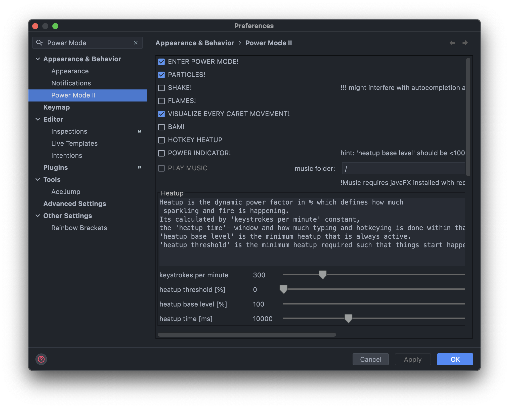
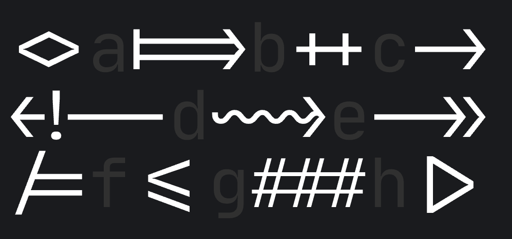
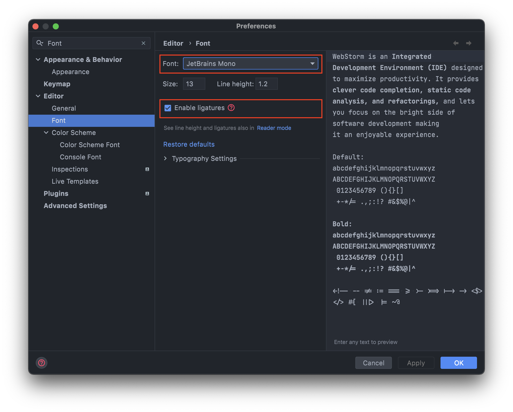
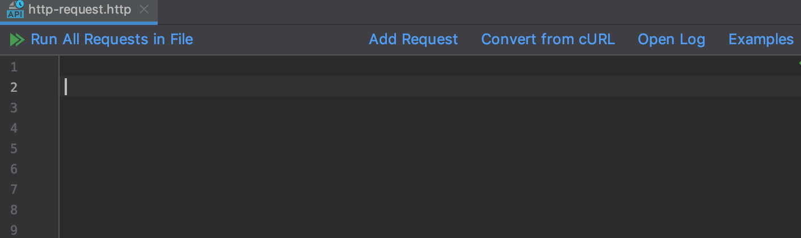
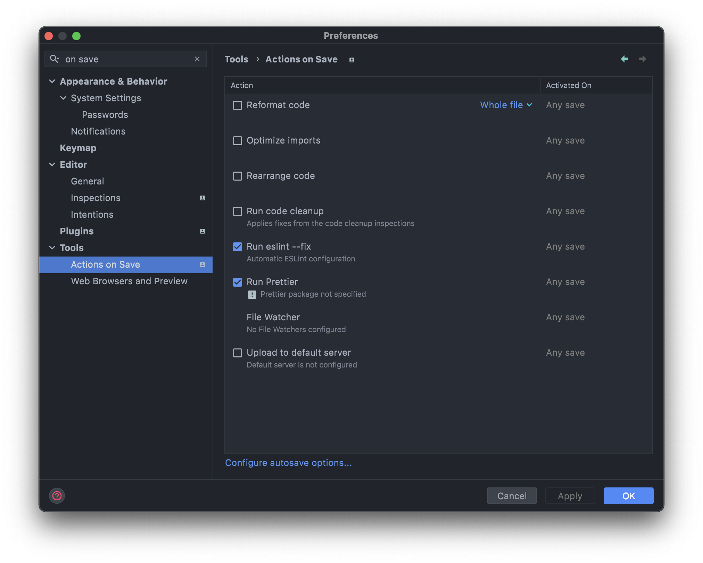
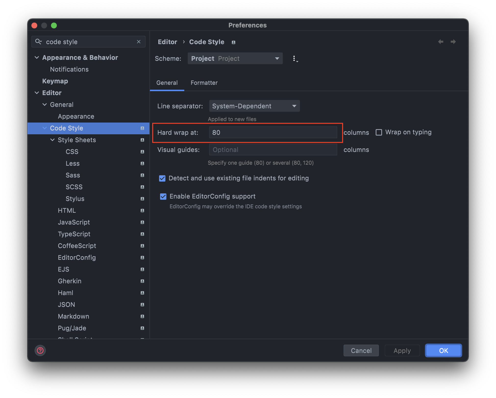

# 👋 개요

VS Code에서 WebStorm으로 이사 중 내가 설정한 내용들을 공유하고자 포스팅 하였습니다.

아직 WebStorm을 많이 사용해보지 않아 VSCode에서 사용하던 기능들을 위주로 세팅하였습니다.

저의 VS Code 설정을 보고 싶다면 [여기](https://minemanemo.tistory.com/163)를 참고해주세요

VS Code를 맥에서 쓸때 이모지 단축키가 작동이 잘 안되던가 한글 입력이 잘 안되던가 등이 있습니다.

WebStorm을 사용하면서 좋았던 점은 강력한 디버그 기능을 꼽을 수 있겠습니다.

아래에 제가 한달간 WebStorm을 사용하면서 사용한 단축키, 플러그인, 기능 들에 대하여 기술하였습니다.

# ⌨ 단축키

제가 Mac을 사용하기에 단축키는 mac 기준으로 작성합니다. (윈도우 죄송합니다 🙏🏼)

제가 JavaScript 개발하면서 진짜 중요하다고 생각되는 단축키에는 ⭐️로 강조 하겠습니다 😃

처음부터 단축키를 모두 알 필요가 없는게 아래 기술하는 [Key Promoter X](https://plugins.jetbrains.com/plugin/9792-key-promoter-x) Plugin의 도움으로 조금 씩 익숙해져 봅시다.

| What?                          | shortcut                                            |
| ------------------------------ | --------------------------------------------------- |
| 전체 검색                      | `shift` + `shift`                                   |
| 정의로 이동                    | `Command` + `B` or `Command` + `Click`              |
| 점진적으로 범위 확장 선택/해제 | `Option` + 위/아래 방향키                           |
| 커서가 위치한 라인 이동        | `Shift` + `Option` + 위/아래 방향키                 |
| 세로 드래그 (마우스)           | `Option` + `Shift` + 마우스 드래그                  |
| 세로 드래그 (키보드)           | `Option` + `Option` 누른 상태 유지 후 위아래 방향키 |
| 최근 파일 보기                 | `Command` + `E`                                     |
| 최근 파일 보기 (프리뷰 포함)   | `Command` + `Shift` + `E`                           |
| 줄 단위 이동                   | `Option` + `Shift` + 위,아래 방향키                 |
| 메서드 단위 이동               | `Command` + `Shift` + 위,아래 방향키                |
| 같은 Word 선택                 | `Control` + `G`                                     |
| 파일 안의 같은 Word 선택       | `Shift` + `Control` + `G`                           |
| 현재 라인 복사                 | `Control` + `d`                                     |
| 한줄 지우기                    | `Command` + `Backspace`                             |
| 한줄 잘라내기                  | `Command` + `X`                                     |
| ESLint 코드 Fix                | `Command` + `;`                                     |
| Package Import                 | `Control` + `Space`                                 |
| 한줄 주석                      | `Control` + `/`                                     |
| 여러줄 주석                    | `Control` + `Shift` + `/`                           |

# Plugins

추천도는 약 1달간 사용한 뒤 판단하였다.

## [AceJump](https://plugins.jetbrains.com/plugin/index?xmlId=AceJump) (추천도: ⭐️)

> 에디터 내에서 빠르게 위치를 이동할 수 있는 Navigator Plugin이다.

Chrome의 VIM Plugin을 써봤다면 익숙할 것이다. (UX가 비슷하게 동작한다.)

단축키는 Mac 기준 `Control` + `;` 이며

Google 검색해서 나온 추천 Plugin이긴 한데 VIM을 나름 잘 사용했던 내 기준에서도 익숙해지기 좀 힘들다.

아마 1주일 정도 사용해보다가 지울 것 같은 냄새가 난다.

현재 미사용 중

## [CodeGlance](https://plugins.jetbrains.com/plugin/7275-codeglance) (추천도: ⭐️⭐️)

> 에디터 창 내에 코드 미니맵을 보여주는 Plugin이다.

본인은 파일 하나에 소스코드 라인 수가 너무 많은 것을 기피하는 사람이다.

(가독성을 해친다 라는 이유로 너무 긴 소스 코드는 리펙토링 대상이라고 생각한다.)

VS Code에서는 Source Code Mini Map은 기본 기능으로 포함되어있는데 본인은 해당 기능을 끄고 사용했었다.

따라서 이 Plugin은 크게 필요성을 느끼지 못 한다.

## [Codota](https://plugins.jetbrains.com/plugin/7638-codota-ai-autocomplete-for-java-and-javascript), [Tabnine](https://plugins.jetbrains.com/plugin/12798-tabnine-ai-code-completion-js-java-python-ts-rust-go-php--more) (추천도: ⭐️⭐️⭐️)

> AI 코드 완성 Plugin

- Codota: Java & JavaScript AI 코드 완성 Plugin (곧 서비스 종료 예정)
- Tabnine: 모든 언어를 지원하는 AI 코드 완성 Plugin

요즘 MS의 Copilot이 핫 하다. ([Copilot 소개](https://www.youtube.com/watch?v=x_yw2f161cu), [라이선스 관련 이슈](https://www.youtube.com/watch?v=a9349pRiCRk))

이런 서비스들의 출시로 '나도 언젠가 AI로 대체 되려나?'라는 생각이 들 정도로 무섭다는 생각과 AI의 발전이 대단하다는 생각을 하게된다.

VS Code에는 Copilot 확장 앱이 있는데 사용 예약 신청을 하고 기별이 없었지만
WebStorm으로 넘어오기 직전 Copilot의 사용 허가가 되어 잠시 사용해봤다. (끝내주게 신기하다)

Codota와 Tabnine도 Copilot과 같은 기능을 제공해줄 것이라고 생각이 된다.

아래와 같은 기능들을 제공해준다.

- 전체 라인 자동 완성
- 인라인 및 관련 코드 예제
- 본인이 작성한 코드를 기반으로 코드 제안

잘만 사용하면 주니어 개발자들이 좋은 소스코드를 참고할 수 있는 앱 아닐까?

~~아직 사용을 길게 해보지 않아서 평가를 내리기 이르다는 판단에 이야기는 여기까지만 하겠다.~~

### 1달 사용 후기

약 1달간 사용해본 결과 편한점, 불편한 점이 두가지가 공존했다.

지금은 Plugin을 Disable 후 사용 중 이다.

[ 편한 점 ]

- 코드를 자동 추천으로 타이핑 수가 줄어듬
- 영문 작성 시 철자가 틀리는 경우가 줄어듬

[ 불편한 점 ]

- 불편한 경우는 입력한 하나의 문자마다 제안 또는 추천해주는게 달라지는데 개발하면서 제안되는 사항을 눈으로 인식하고
  제안사항을 받아들이기에는 다음 타이핑을 빠르게 치는 손으로 인해서 오히려 불편하다고 느낄 때가 종종 있었다.

## [ESLint Restart Service Action](https://plugins.jetbrains.com/plugin/14119-eslint-restart-service-action) (추천도: ⭐️⭐️⭐️⭐️⭐️)

> ESLint 서비스 재시작 Plugin

개발환경에서 ESLint를 사용하는 사람이라면 이 Plugin을 정말 유용하게 사용할 것이다.

ESLint 설정의 변경에 트리거가 잘 걸려 있어 설정 리로딩이 잘 된다면 상관 없지만

개발하는 사람마다 ESLint나 Prettier의 사용 방법이 차이가 있는 만큼

자동으로 설정 리로딩이 되지 않는 경우가 종종 있다.

이럴때 사용하면 유용하다.

사용 방법은 Search Everywhere(`Shift` + `Shift`) 후 `Restart ESLint Service`를 검색 후 선택하여 사용하면 된다.

## Progress Bar (추천도: ⭐️⭐️⭐️⭐️)

> Progress Bar를 꾸며주는 Plugin

이런 류의 기능 없이 UI만 바꿔주는 Plugin을 '귀엽다', '멋있다', '간지난다' 라고 생각하는

당신은 아마 일반인의 범주를 넘어서 개발자가 마인드가 뿜뿜한 사람일 것이다.

(역시 예쁜건 못 참아...)

본인이 'Wls' 이라면 아래에서 맘에드는 걸 선택해서 설치하면 된다. (또는 Marketplace에서 Progress Bar라고 검색하면 된다)

- Nyan Progress Bar(고양이): 62.86 KB [바로가기](https://plugins.jetbrains.com/plugin/8575-nyan-progress-bar)
- Mario Progress Bar(마리오): 29.43 KB [바로가기](https://plugins.jetbrains.com/plugin/14708-mario-progress-bar)
- Pokenmon Progress(포켓몬): 855.75 KB [바로가기](https://plugins.jetbrains.com/plugin/15090-pokemon-progress)
- Gopher(어떤 캐릭터?): 38.43 KB [바로가기](https://plugins.jetbrains.com/plugin/12875-gopher)
- Sonic Progress Bar(소닉): 13.31 KB [바로가기](https://plugins.jetbrains.com/plugin/14725-sonic-progress-bar)

## [Power Mode 2](https://plugins.jetbrains.com/plugin/8251-power-mode-ii) (추천도: ⭐️⭐️⭐️⭐️⭐️)

> 타이밍, 커서 이동 등의 행위를 할 때마다 이펙트를 발생 시켜주는 Plugin

VS Code에서도 Power Mode를 사용 중 이였다.

와... 간지력이 더 상승하였다... 개인적으로 무지성 설치 바란다.

아래는 내가 사용하는 설정이다.

- 참고로 `SHAKE!` 옵션을 켜두먼 머리아플 수 있어서 Disable 시키는걸 추천한다.

## Font & Color Theme: [Jetbrains Mono](<(https://www.jetbrains.com/ko-kr/lp/mono/)>), [One Dark theme](https://plugins.jetbrains.com/plugin/11938-one-dark-theme) (추천도: ⭐️⭐️⭐️⭐️⭐️)

> IDE의 Font와 Color Theme Plugin

개발 도구를 쓸때 테마를 이용하면 적절한 색 조합으로 가독성이 좋아질 수 있고 심심한 느낌을 달랠 수 있다.

아래는 Marketplace에서 Color Theme를 Download 수로 검색하였을때 상위 3개의 Plugin이다.

1. [Material Theme UI](https://plugins.jetbrains.com/plugin/8006-material-theme-ui)
2. [One Dark theme](https://plugins.jetbrains.com/plugin/11938-one-dark-theme)
3. [Dracula Theme](https://plugins.jetbrains.com/plugin/12275-dracula-theme)

처음에는 Material Theme를 사용하려고 했지만 작은 문제가 발생하였다.

2020.01에 Jetbrains에서는 개발자를 위한 Font를 발표하였다. ([링크](https://www.jetbrains.com/ko-kr/lp/mono/))

이 폰트에는 위와 같이 개발하는데 몇가지의 기호들을 하나의 기호로 표현하는 이음자 기능이 있다.

(~~정말 간지나는 Font 아닌가!~~)

근데 Material Theme에서는 이 이음자 기능을 사용할 수 없었다... (이유는 찾기 귀찮아서 찾지 않았다.)

그래서 그 대안으로 One Dark Theme를 선택하였으며 Dracula Theme도 이음자 옵션이 잘 적용 된다.

Search Everywhere(`Shift` + `Shift`) 후 `Font`입력 후 아래와 같이 설정

## Icon Theme: [Atom Material Icons](https://plugins.jetbrains.com/plugin/10044-atom-material-icons), [Extra Icons](https://plugins.jetbrains.com/plugin/11058-extra-icons) (추천도: ⭐️⭐️⭐️⭐️⭐️)

VS Code 사용할 때에도 Material Icons Theme를 사용했기에 익숙하여 WebStorm에서도 같은 플러그인을 선택하였다.

하지만 Extra Icons도 사용해볼 예정이다. 그 이유는 Plugin Size 때문이다.

- Atom Material Icons: 16.25MB
- Extra Icons: 1.16MB

Size 차이가 생각보다 크다.

오래 사용하며 비교해봐야겠지만 WebStorm 로딩 속도에 차이가 있지 않을까 생각된다.

(본인은 Intel Macbook Pro 16인치 고급형을 사용하고 있어
로딩 속도의 차이는 크게 없을 것 같고 WebStorm 로딩 속도가 느리다면 아마도 다른 이유일 것이다.)

## [Key Promoter X](https://plugins.jetbrains.com/plugin/9792-key-promoter-x) (추천도: ⭐️⭐️⭐️)

> GUI 사용 시 단축키를 알려주는 Plugin

이 글의 독자들은 VS Code에서 WebStorm으로 갓 넘어온 사용자들이 될 것이라고 생각된다.

본인 뿐아니라 여러분들도 느끼는 제일 불편한 점이 단축키의 익숙하지 않음이 제일 크지 않을까? 생각든다.

Key Promoter X는 이런 경우에 안성 맞춤이라고 생각된다.

Key Promoter X을 설치하고 WebStorm의 GUI를 이용하다보면 우측 하단에 단축키를 알려준다.

이 Plugin을 사용하다보면 어느새 WebStorm의 단축키를 마스터한 여러분을 볼수 있지않을까 생각된다.

## [Quick File Preview](https://plugins.jetbrains.com/plugin/12778-quick-file-preview) (추천도: ⭐️⭐️⭐️⭐️)

> File을 빠르게 볼 수 있게 해주는 Plugin

WebStorm 처음 사용할 때 File Browser에서 파일을 선택해도 바로 열리지 않고 두번 클릭해야 파일이 열린다.

이때 이 Plugin을 사용하면 한번만 파일을 선택해도 바로 미리볼 수 있다.

## [Rainbow Brackets](https://plugins.jetbrains.com/plugin/10080-rainbow-brackets) (추천도: ⭐️⭐️⭐️⭐️⭐️)

> Code 상의 Bracket 들을 서로 다른 색으로 쉽게 구분할 수 있게 도와주는 Plugin

VS Code 사용할 때도 비슷한 확장앱을 사용했었을 정도로 유용한 Plugin이다.

무지성 설치하자!

## Hightlight Matching Tag

## TODO Hightlight

## [Git Toolbox](https://plugins.jetbrains.com/plugin/7499-gittoolbox) (추천도: ⭐️⭐️⭐️⭐️⭐️)

> Git 기능을 확장 시켜주는 Plugin

Git과 관련된 여러 기능을 확장해주는데 내가 사용할 기능들은 아래와 같다.

- 상태 표시줄에 Git 상태 추가
- 에디터의 인라인에 최근 커밋 내용 표시
- Auto Fetch

특히 `에디터의 인라인에 최근 커밋 내용 표시` 기능은 VS Code 사용할 때 `GitLens`와 유사항 기능을 제공해준다.

## [LogIt](https://plugins.jetbrains.com/plugin/13432-logit) (추천도: ⭐️⭐️⭐️⭐️)

> Javascript console.log 를 빠르게 찍을 수 있는 Plugin

VS Code에서는 Turbo Console log를 애용했었다.

비슷한 기능을 제공해주며 강력한 Debug 기능을 제공해주는 WebStorm에서 유용하게 사용되는 듯하다.

## [Import Cost](https://plugins.jetbrains.com/plugin/9970-import-cost) (추천도: ⭐️⭐️⭐️)

> Import한 JavaScript Module Size를 에디터에 표시해준다.

Bundle 사이즈를 줄이는데 도움이 되길 바라며 설치하였으나 막상 많이 보게 되지 않는다.

## [Indent Rainbow](https://plugins.jetbrains.com/plugin/13308-indent-rainbow) (추천도: ⭐️⭐️⭐️⭐️⭐️)

> 들여쓰기의 깊이를 서로 다른 색으로 구별하기 슆게 해주는 Plugin

VS Code에서도 유용하게 사용하였다.

무지성 설치 바란다.

## 기본 제공 기능: [Rest Client](https://www.jetbrains.com/help/webstorm/http-client-in-product-code-editor.html)

## Tab Size

## 저장 시 자동 Format: [Actions on Save](https://www.jetbrains.com/help/webstorm/saving-and-reverting-changes.html#actions-on-save)

아래와 같이 설정

## Editor Rule

> 에디터의 구분선 길이를 설정하는 기능

아래와 같이 설정할 수 있고 언어마다 다르게 설정 가능하다.

## Auto Close Tag, Auto Rename Tag

- Auto Cose Tag: 태그 자동 닫기 기능
- Auto Rename Tag: 태그 명 수정 시 반대 쪽 태그를 자동으로 수정해주는 기능

고맙게도 WebStorm은 위 두가지 기능을 기본으로 제공해주고 있다.

# Referrence

- https://blog.jetbrains.com/ko/webstorm/2021/06/plugins-for-webstorm-you-need-to-know-about
